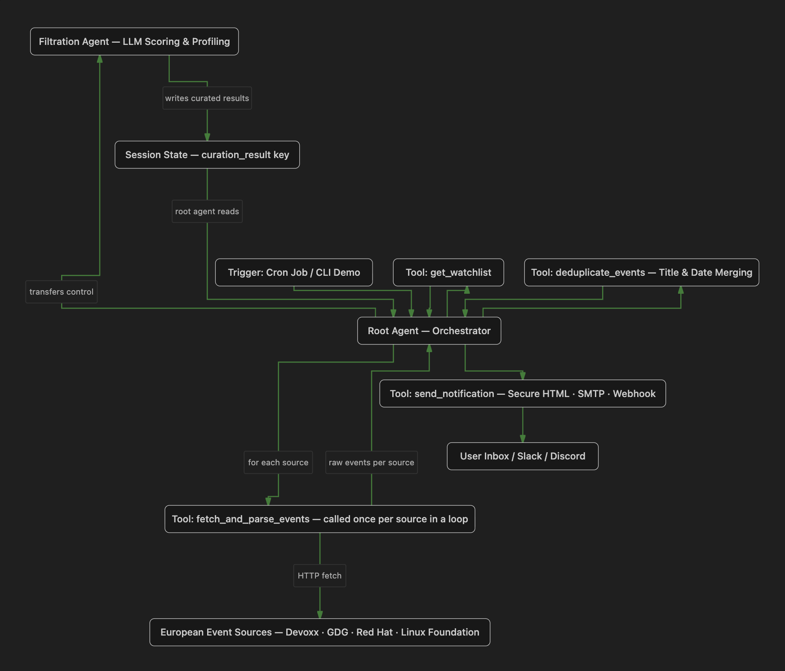

# TechEvent Finder

An autonomous agent that monitors European tech conferences and developer events, scores them against a target profile, and delivers a curated shortlist directly to your inbox — automatically.

---

## What it does

Keeping track of tech events across Europe is noisy and time-consuming. This project automates that. It watches a curated list of event sources — conference sites, community calendars, and platform feeds — fetches what's coming up, removes duplicates, and then uses an AI model to evaluate which events actually matter based on a specific developer profile. The result lands in your email.

No manual browsing. No copy-pasting. Just a clean, scored list when you need it.

---

## How it works

The system is built as a chain of steps, each handled by a dedicated piece of code:

### 1. Fetch events from sources
A tool reads a built-in list of 20 European tech event sources — including Devoxx, Red Hat Events, GDG, the Linux Foundation, WeAreDevelopers, and community feeds across Italy, the Netherlands, Poland, Switzerland, Croatia, Portugal (Lisbon), and more. For each source, it makes an HTTP request and extracts event candidates.

### 2. Remove duplicates
Multiple sources often report the same event. Before any scoring happens, a deduplication step compares events by their title and date, and keeps only one copy of each.

### 3. Score and filter with AI
A dedicated AI agent (powered by Gemini) reads through the deduplicated list and scores each event between 0 and 100 based on relevance to this profile:
- Cloud infrastructure (Kubernetes, Terraform, AWS / GCP / Azure)
- Go (Golang) and system tooling
- Python and AI / data tooling
- Observability and monitoring (Prometheus, OpenTelemetry)
- AI engineering and agent development

Any event located outside of Europe automatically scores 0 and is dropped. Each kept event also gets a short written justification for its score.

### 4. Deliver the results
Once scoring is done, the top events are formatted into a clean HTML table and sent to a configured email address over a secure SMTP connection. If a webhook URL is configured (Slack, Discord, etc.), the results are posted there too. Either way, the full list is also saved locally as a JSON file for reference.

---

## Architecture



```mermaid
flowchart TD
    classDef node fill:#ffffff,stroke:#1b5e20,stroke-width:2px,color:#1b5e20,font-weight:bold
    classDef state fill:#f1f8f1,stroke:#1b5e20,stroke-width:1.5px,color:#1b5e20,font-style:italic
    linkStyle default stroke:#2e7d32,stroke-width:1.5px

    Trigger(Trigger: Cron Job / CLI Demo) ::: node
    Root(Root Agent — Orchestrator) ::: node
    Watchlist(Tool: get_watchlist) ::: node
    Loop(Tool: fetch_and_parse_events — called once per source in a loop) ::: node
    Sources(European Event Sources — Devoxx · GDG · Red Hat · Linux Foundation) ::: node
    Dedup(Tool: deduplicate_events — Title & Date Merging) ::: node
    Filter(Filtration Agent — LLM Scoring & Profiling) ::: node
    State(Session State — curation_result key) ::: state
    Notify(Tool: send_notification — Secure HTML · SMTP · Webhook) ::: node
    Deliver(User Inbox / Slack / Discord) ::: node

    Trigger --> Root
    Root --> Watchlist
    Watchlist --> Root
    Root -->|for each source| Loop
    Loop <-->|HTTP fetch| Sources
    Loop -->|raw events per source| Root
    Root --> Dedup
    Dedup --> Root
    Root -->|transfers control| Filter
    Filter -->|writes curated results| State
    State -->|root agent reads| Root
    Root --> Notify
    Notify --> Deliver
```

---

## Key technical decisions

**Why two agents?**
The orchestrator (root agent) handles coordination — fetching, deduplicating, and dispatching. The filtration agent handles judgment — scoring and justifying. Keeping these separate means each does one thing well and the scoring logic can be tuned independently.

**Why is deduplication done before the AI step?**
AI calls cost tokens and time. Running deduplication first means the model only evaluates each unique event once, not the same event three times because three different sites listed it.

**How are links kept safe in the email?**
Before any event link is inserted into the HTML email, the code validates that the URL starts with `http://` or `https://`. It then escapes all special characters to prevent any injected content from being interpreted as HTML or JavaScript inside the email client.

**Where are credentials stored?**
Nowhere in the code. All sensitive values — email address, app password, webhook URL, and API key — are read exclusively from environment variables at runtime. The `.env.example` file in the repository shows which variables are needed, without containing any real values.

---

## Security

The email delivery pipeline handles data from external websites — sources that are not under our control. That means any piece of text that gets scraped could, in theory, contain malicious content designed to hijack the email or trick the reader's email client. Three layers of protection are in place to prevent that.

### 1. URL scheme validation
Every event link scraped from an external source is checked before it is placed into the email. The code explicitly verifies that the URL begins with `http://` or `https://`. If it starts with anything else — such as `javascript:`, `data:`, or `vbscript:` — the link is silently dropped and the event title is rendered as plain text instead. This blocks a common class of attack where a malicious actor injects a fake URL that executes code inside the reader's email client when clicked.

### 2. HTML character escaping
Even after a URL passes the scheme check, every single piece of text that goes into the email — the event title, date, location, relevance justification, and the URL itself — is passed through Python's built-in `html.escape()` function with full quote escaping enabled. This converts characters like `<`, `>`, `"`, and `&` into their safe HTML equivalents (`&lt;`, `&gt;`, `&quot;`, `&amp;`). The result is that even if a scraped event title contained something like `<script>alert('xss')</script>`, it would appear in the email as harmless visible text, not as executable code.

### 3. No credentials in code
The email credentials (sender address, app password, and receiver address) are never written into the source code or committed to the repository. They are loaded exclusively from environment variables at runtime. This means that even if the repository were made public, no sensitive credentials would be exposed.

Together, these three measures ensure that the pipeline cannot be used as a vector to deliver malicious content to the inbox, regardless of what the upstream event sources contain.

---

## Setup

**Requirements:** Python 3.11+, `uv`

```bash
# Install dependencies
uv sync

# Copy and fill in your credentials
cp .env.example .env

# Run interactively in the browser playground
agents-cli playground

# Or run as a background job
uv run python run_job.py

# Or run the demo mode (no API quota used)
uv run python run_demo.py
```

**Environment variables needed in `.env`:**

| Variable | Purpose |
|---|---|
| `GOOGLE_API_KEY` | Gemini API access |
| `SENDER_EMAIL` | Gmail address that sends the notification |
| `RECEIVER_EMAIL` | Address that receives the curated list |
| `EMAIL_APP_PASSWORD` | Gmail App Password (not your login password) |
| `WEBHOOK_URL` | Optional — Slack or Discord webhook for posting results |

---

## Project structure

```
app/
  agent.py       — defines the two agents and their instructions
  tools.py       — all tool functions: watchlist, fetcher, deduplicator, notifier
  schemas.py     — data model for a validated event object
  notifier.py    — SMTP email dispatch over a secure TLS connection
run_demo.py      — simulates the full pipeline without using API quota
run_job.py       — runs the full pipeline autonomously as a background job
```
